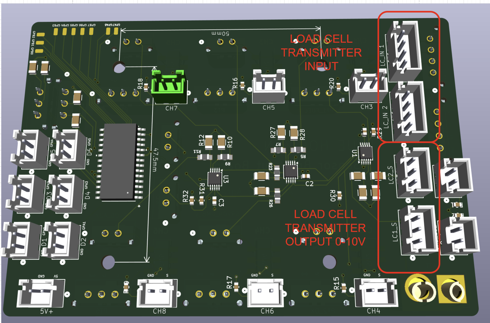

# DAQ System

## System Overview

This sensor acquisition system is designed to collect, condition, and digitize data from multiple instrumentation sources used in propulsion and fluid system testing. The system supports a range of analog sensors, including load cells, pressure transducers, and position-related servo sensors, and provides structured pathways for both high-resolution data logging and real-time microcontroller access.

### Core Functionality

The system performs the following primary functions:

- **Sensor Data Acquisition**  
    Accepts analog inputs from:
    - Load cells (e.g., engine thrust measurement, propellant tank weight)
    - Pressure transducers (e.g., nitrous oxide and fuel system pressures)
    - Servo-based position sensors (e.g., tank fill valve position verification, engine gimbal axis position)
- **Signal Routing and Digitization**
    - Routes analog sensor signals to a **DATAQ WINDAQ system** for visualization, recording, and storage (including SD card logging).
    - Simultaneously routes selected critical signals (load cells, fuel and NOx pressures, and servo positions) through an **ADS1115 ADC**, enabling digitization for embedded processing.
- **Microcontroller Integration**
    - Provides access to digitized sensor data via an I²C interface to a Teensy microcontroller, enabling real-time monitoring, control logic, and downstream processing.
- **Event Timing Capture**
    - Accepts digital input signals to log key event markers (e.g., valve actuation start times or other test events), allowing synchronization between sensor data and system actions.

---

### System Scope and Limitations

This system is intended for data acquisition and monitoring purposes only. It is important to clearly define what the system does **not** do:

- **No Closed-Loop Control**  
    The system does not directly control actuators, valves, or engines. It provides data for monitoring and analysis but does not execute control logic autonomously.
- **No Sensor Calibration or Compensation**  
    Calibration of load cells, pressure transducers, and servo sensors must be performed externally. The system assumes properly conditioned and calibrated input signals.
- **No High-Level Data Processing or Interpretation**  
    The system does not perform advanced analytics, filtering, or decision-making beyond basic digitization and routing. Any such processing must be implemented on the connected microcontroller or external systems.

